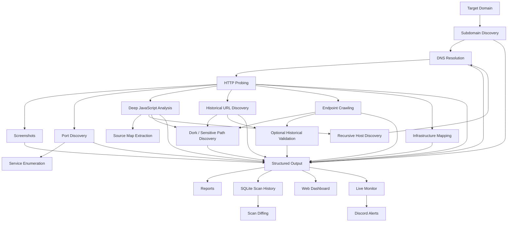

# 404Plyh

> **Recon Triage Center for bug bounty and authorized attack-surface research**

404Plyh is a modular reconnaissance, monitoring, triage, and reporting framework built to turn a large external attack surface into a structured dataset that is easier to investigate manually.

Instead of stopping at a flat list of subdomains or URLs, 404Plyh chains multiple reconnaissance stages together, enriches the results, stores them in predictable directories, ingests scan history into SQLite, tracks changes over time, and exposes everything through a browser-based triage dashboard.

The project is designed around a simple idea:

> **Discovery should produce investigation-ready context, not just more text files.**

---

## Table of Contents

- [What 404Plyh Does](#what-404plyh-does)
- [Architecture](#architecture)
- [Technology Stack](#technology-stack)
- [Reconnaissance Pipeline](#reconnaissance-pipeline)
- [Triage Dashboard](#triage-dashboard)
- [Hunt Queue and Prioritization](#hunt-queue-and-prioritization)
- [Continuous Monitoring](#continuous-monitoring)
- [SQLite Scan History](#sqlite-scan-history)
- [Scope Engine](#scope-engine)
- [Adaptive Rate Guard](#adaptive-rate-guard)
- [Reports and Notifications](#reports-and-notifications)
- [Requirements](#requirements)
- [Installation](#installation)
- [Usage](#usage)
- [Configuration](#configuration)
- [Output Structure](#output-structure)
- [Dashboard API](#dashboard-api)
- [Testing](#testing)
- [Implementation Notes and Limitations](#implementation-notes-and-limitations)
- [Operational Security](#operational-security)
- [Project Structure](#project-structure)
- [Responsible Use](#responsible-use)
- [License Status](#license-status)

---

# What 404Plyh Does

404Plyh combines passive discovery, active validation, endpoint collection, JavaScript analysis, infrastructure mapping, change detection, and human-focused triage into one workflow.

Its current capabilities include:

- multi-source subdomain enumeration
- DNS validation and wildcard-aware resolution through `puredns`
- HTTP/HTTPS probing and technology fingerprinting
- screenshot capture
- TCP port discovery and service enumeration
- deep JavaScript collection and static analysis
- source-map discovery and source reconstruction
- historical URL discovery
- endpoint crawling
- passive and active sensitive-file discovery
- optional conservative validation of interesting historical URLs
- infrastructure and shared-IP mapping
- scan reporting in text, JSON, and HTML
- browser-based multi-target project exploration
- heuristic asset prioritization through a Hunt Queue
- scan history stored in SQLite
- scan-to-scan diffing
- live subdomain and port monitoring
- Discord webhook notifications
- per-target scope controls
- CPU-aware request throttling
- raw-result access for manual investigation

404Plyh is intentionally **modular**. Missing optional tools do not normally kill the entire scan; the associated stage is skipped and the rest of the pipeline continues.

---

# Architecture



At runtime, the main entry point is `recon_engine.sh`. It loads individual Bash modules from `modules/`, creates a target-specific output tree, executes each enabled stage, generates reports, and optionally sends a Discord notification when the scan finishes.

The dashboard is a separate Python process. It reads recon data from target directories, serves the HTML/JavaScript frontend, can launch scans, manages monitoring configuration, and stores scan snapshots in SQLite.

---

# Technology Stack

404Plyh deliberately avoids a heavy application framework. Most of the project is shell orchestration plus small Python and browser-side components.

| Layer | Technology | Role |
|---|---|---|
| Orchestration | **Bash** | Main recon pipeline, module execution, monitoring, reporting, notifications |
| Backend | **Python 3 standard library** | Dashboard HTTP server, scan process management, API endpoints |
| Database | **SQLite** | Per-target scan history and scan-to-scan comparison |
| Frontend | **Vanilla JavaScript** | Dashboard interaction, filtering, Hunt Queue, tables, scan controls |
| UI | **HTML + CSS** | Single-page reconnaissance triage interface |
| Static analysis | **Python 3** | JavaScript secret, endpoint, leakage, and comment scanning |
| Source reconstruction | **Python 3** | JavaScript source-map extraction |
| Data processing | **jq, grep, awk, sed, sort, comm** | JSON processing, normalization, filtering, diffs |
| HTTP collection | **curl, httpx** | CT queries, HTTP validation, metadata collection, active probes |
| Notifications | **Discord Webhooks** | Scan-complete and monitor-change alerts |

## External Reconnaissance Tooling

### Subdomain discovery

- `subfinder`
- `amass`
- `assetfinder`
- `chaos`
- `crt.sh`

### DNS

- `puredns`
- custom or bundled resolver lists

### Web probing

- `httpx`

### Screenshots

- `gowitness`

### Network discovery

- `naabu`
- `nmap`

### Crawling

- `katana`
- `hakrawler`

### Historical intelligence

- `gau`
- `waybackurls`

### Infrastructure intelligence

- `amass intel`
- `whois`

### JavaScript intelligence

The current main pipeline uses the built-in deep JavaScript engine:

- `katana` for script discovery
- `httpx` for script/source-map validation
- `curl` for local collection
- `modules/js_scanner.py` for static analysis
- `modules/sourcemap_extractor.py` for reconstructing original source files

The repository also contains `modules/js.sh`, an older/alternative JavaScript analysis module designed around LinkFinder and SecretFinder. The current orchestrator sources `modules/js_deep.sh` instead.

---

# Reconnaissance Pipeline

## 1. Subdomain Discovery

**Module:** `modules/subdomain.sh`

The first stage combines independent sources to improve coverage:

- Subfinder with all configured sources
- Amass in passive mode
- Assetfinder
- ProjectDiscovery Chaos
- Certificate Transparency data from `crt.sh`

`crt.sh` results are queried as JSON, wildcard prefixes are stripped, and all sources are merged.

Hostnames are normalized by:

- converting to lowercase
- stripping `*.` wildcard prefixes
- stripping trailing dots
- dropping empty lines
- limiting results to the target domain suffix
- deduplicating with `sort -u`

Primary output:

```text
subs/all.txt
```

---

## 2. DNS Resolution and Validation

**Module:** `modules/dns.sh`

`puredns` validates discovered hosts using either:

1. a resolver list supplied with `--resolvers`, or
2. the bundled `resolvers.txt`.

The module writes resolved and unresolved hosts separately.

Primary outputs:

```text
dns/resolved.txt
dns/unresolved.txt
```

If `puredns` is unavailable or fails to return results, the pipeline falls back to copying the discovered subdomain list into `resolved.txt` so downstream stages can continue. This fallback keeps the workflow alive but means that file should not be interpreted as cryptographic proof that every entry successfully resolved.

---

## 3. HTTP Service Discovery

**Module:** `modules/http.sh`

Resolved hosts are probed using `httpx`.

Collected metadata includes:

- HTTP status code
- page title
- technology fingerprint
- web server header
- IP address
- redirects
- final URL

The raw result is stored as JSON Lines, while convenience files are generated for alive URLs and a text summary.

Primary outputs:

```text
httpx/results.json
httpx/alive.txt
httpx/summary.txt
```

---

## 4. Visual Surface Mapping

**Module:** `modules/screenshots.sh`

Alive web services are passed to `gowitness` to capture screenshots.

This gives the dashboard a visual view of discovered web applications and reduces the amount of manual tab-opening required during triage.

Output directory:

```text
screenshots/
```

---

## 5. Network Service Enumeration

**Module:** `modules/ports.sh`

Port discovery is performed in two stages.

### Naabu

`naabu` scans the configured number of top ports and writes:

```text
ports/naabu.txt
ports/naabu.json
ports/hosts_with_ports.txt
```

The plain-text file uses `host:port` records and the JSON run preserves structured results.

### Nmap

Hosts with discovered ports are passed to Nmap for deeper service enumeration using:

```text
-sV -sC --top-ports 100
```

Nmap output is written in the standard `-oA` formats.

If Naabu produces no results, the Nmap fallback limits itself to the first 50 targets to avoid turning a fallback path into an unexpectedly massive scan.

### Port-based HTTP re-probing

Naabu results are fed back into `httpx` so HTTP applications running on non-standard ports can be added to the main alive-service list.

---

## 6. Deep JavaScript Intelligence Engine

**Module:** `modules/js_deep.sh`

This is one of the more involved stages in the project.

### Script discovery

JavaScript URLs are collected from:

- Katana script discovery
- existing crawled endpoints
- historical URLs
- direct HTML scraping fallback using `curl`

### Validation

Discovered JavaScript URLs are checked with `httpx`. HTTP 200 scripts are preferred, with a fallback to the discovered list if validation does not produce usable output.

### Local collection

Scripts are downloaded to:

```text
js/files/
```

Each URL is mapped to a local MD5-based filename in:

```text
js/scripts_map.txt
```

### Source-map discovery

For each active JavaScript file, 404Plyh probes the corresponding `.js.map` URL.

Exposed source maps are downloaded and passed to:

```text
modules/sourcemap_extractor.py
```

The extractor:

- parses source-map JSON
- reads `sources` and `sourcesContent`
- strips protocol/webpack prefixes
- sanitizes output paths
- reconstructs original source files

Reconstructed files are stored under:

```text
js/extracted_maps/
```

### Static analysis

`modules/js_scanner.py` recursively analyzes JavaScript, text, and JSON files.

It extracts:

- relative endpoints
- potential secrets
- internal IP addresses
- development/internal domain names
- interesting developer comments

Current secret patterns include signatures for:

- AWS access keys
- AWS-style secret keys
- Google API keys
- Firebase URLs
- Slack webhooks
- GitHub tokens
- Stripe keys
- Discord webhooks
- Facebook/OAuth-style indicators
- JWTs
- Mailgun keys
- generic API/auth/session tokens
- private-key headers

Developer comments are retained when they contain terms such as:

- `TODO`
- `FIXME`
- `BUG`
- `HACK`
- `password`
- `credential`
- `secret`
- `deprecated`
- `remove`
- `debug`
- `bypass`

Static-analysis outputs include:

```text
js/endpoints.txt
js/api_endpoints.txt
js/secrets.txt
js/leakage.txt
js/comments.txt
```

### Recursive discovery

If JS analysis reveals previously unknown hostnames belonging to the target domain, those hosts are merged back into `subs/all.txt`.

The pipeline then repeats:

```text
DNS -> HTTP -> JS
```

until no new hosts are discovered or the configured recursion limit is reached.

Default recursion rounds: **2**.

---

## 7. Historical Surface Discovery

**Module:** `modules/historical.sh`

Historical URLs are collected with:

- `gau`
- `waybackurls`

Results are merged into:

```text
historical/all_urls.txt
```

If `httpx` is available, the module also checks which historical URLs remain accessible today.

Output:

```text
historical/alive.txt
```

Historical data is useful for identifying:

- removed UI routes
- legacy API paths
- old admin panels
- forgotten files
- old application versions
- endpoints no longer linked from the current frontend

---

## 8. Endpoint and Path Crawling

**Module:** `modules/crawl.sh`

Live applications are crawled with:

- Katana
- Hakrawler

Results are merged and categorized.

Outputs:

```text
endpoints/all.txt
endpoints/interesting_paths.txt
endpoints/api_paths.txt
endpoints/sensitive_files.txt
```

Interesting paths currently include patterns associated with authentication and administration such as login, admin, dashboard, portal, panel, signup, registration, and auth routes.

API categorization looks for patterns such as:

- `/api/`
- versioned paths such as `/v1/`
- GraphQL
- REST
- Swagger
- OpenAPI

Sensitive-file filtering looks for file extensions such as JSON, XML, YAML, configuration files, environment files, backups, SQL dumps, and logs.

---

## 9. Dork-Style Sensitive File Discovery

**Module:** `modules/dorks.sh`

This module has two phases.

### Phase 1: Passive matching

404Plyh builds a combined URL pool from historical data, crawled endpoints, JS findings, API findings, and alive services.

It categorizes URLs into patterns such as:

- configuration files
- backup/database files
- logs/debug artifacts
- admin/management panels
- exposed documents
- development artifacts
- cloud storage references
- credentials or authentication tokens in URLs
- information-disclosure paths

### Phase 2: Active sensitive-path probing

For each alive base URL, the module builds a list of commonly exposed paths and checks them with `httpx`.

The path set includes examples such as:

- `.git/HEAD`
- `.git/config`
- `.env`
- backup environment files
- `wp-config.php`
- `web.config`
- configuration files
- package manifests
- lock files
- `phpinfo.php`
- `robots.txt`
- `sitemap.xml`
- `.well-known/security.txt`
- server-status/debug endpoints
- Spring Actuator routes
- SQL/ZIP backup names
- common admin panels
- Docker and CI files
- error/debug logs

The active phase keeps HTTP **200** and **403** responses and separates them into human-readable result sets.

Primary outputs:

```text
dorks/passive_*.txt
dorks/passive_all.txt
dorks/active_raw.json
dorks/active_hits.txt
dorks/active_200.txt
dorks/active_403.txt
dorks/active_confirmed.txt
dorks/all_findings.txt
```

---

## 10. Optional Historical URL Validation

**Module:** `modules/validate_historical.sh`

This stage is disabled by default and is enabled with:

```bash
--validate-historical
```

It builds a URL pool from historical, crawled, and JavaScript sources, filters that pool for high-interest patterns, and validates only the filtered subset.

The validation stage intentionally uses conservative settings:

- **10 requests/second**
- **5 threads**
- **8-second timeout**
- **0 retries**

Outputs:

```text
historical/probed_interesting.txt
historical/validated_interesting.json
historical/validated_interesting.txt
```

The module also reports a basic 2xx/3xx/4xx/5xx status distribution.

---

## 11. Infrastructure Mapping

**Module:** `modules/infra.sh`

Infrastructure enrichment includes:

- `amass intel -whois`
- IP extraction from HTTPX JSON
- hostname-to-IP mapping
- grouping multiple hosts that share an IP
- web-server/CDN signature detection
- WHOIS ownership lookup
- JSON infrastructure map generation

Common CDN/proxy signatures currently checked include:

- Cloudflare
- Akamai
- Fastly
- CloudFront
- Incapsula
- Sucuri
- Varnish
- Nginx
- Apache

WHOIS lookups are limited to the first **20 unique IP addresses** to avoid excessive requests.

Outputs include:

```text
infra/amass_intel.txt
infra/ip_host_map.txt
infra/unique_ips.txt
infra/ip_groups.txt
infra/server_headers.txt
infra/cdn_hosts.txt
infra/ip_orgs.txt
infra/infra_map.json
```

---

## 12. Structured Report Generation

**Module:** `modules/report.sh`

Each completed scan can produce three report formats:

```text
reports/summary.txt
reports/summary.json
reports/report.html
```

Tracked statistics include:

- discovered subdomains
- resolved hosts
- alive web services
- screenshots
- open port pairs
- JS endpoints
- historical URLs
- crawled endpoints
- dork findings
- validated historical URLs

The generated HTML report contains summary cards and an alive-service table, while the JSON report is intended for automation and downstream tooling.

---

# Triage Dashboard

The repository includes a complete multi-target dashboard:

```bash
python3 dashboard.py -p /path/to/projects
```

Default address:

```text
http://localhost:9090
```

The dashboard backend is intentionally lightweight and uses Python's built-in `http.server` rather than Flask, FastAPI, Django, Node.js, or another web framework.

No third-party Python package is required for the dashboard itself.

## Dashboard capabilities

The current interface exposes views for:

- Overview
- Hunt Queue / Triage
- Assets
- Web applications
- Screenshots
- Historical URLs
- JavaScript findings
- Ports
- Dork findings
- Scan diffing
- Monitor timeline
- Logs
- Raw files

Other dashboard functionality includes:

- multi-target project explorer
- target search
- scan start/stop controls
- selectable module skipping
- progress tracking based on pipeline stage
- scan log tailing
- per-target statistics
- server-side historical URL filtering and pagination
- screenshot browsing
- raw-file inspection
- scan-history ingestion
- scan-to-scan comparison
- monitor enable/disable toggles
- CPU and memory health display on Linux
- scope configuration

The dashboard only allows one active scan process at a time through `ScanManager`.

When a scan finishes, the dashboard automatically attempts to ingest its current results into the target's SQLite database.

---

# Hunt Queue and Prioritization

The browser frontend builds a **Hunt Queue** by correlating multiple signal sources instead of treating every discovered host equally.

Signals currently include:

- non-standard ports
- dork/sensitive-path findings
- JavaScript secrets
- JavaScript leakage
- JavaScript API endpoints
- validated sensitive historical pages
- interesting URL parameters
- authentication-related page titles
- sensitive subdomain names
- administrative/infrastructure technologies
- HTTP 401/403 responses
- available screenshots

## Current heuristic scoring

| Signal | Score |
|---|---:|
| Non-standard port | +2 |
| Dork finding | +4 |
| JS secret | +5 |
| JS leakage | +3 |
| JS API endpoint | +2 |
| Live sensitive historical page | +4 |
| Interesting parameter | +2 |
| Auth/login/admin title | +3 |
| Sensitive subdomain name | +3 |
| Administrative technology | +4 |
| HTTP 401/403 | +3 |

Priority classification:

```text
HIGH  = score >= 7
MED   = score >= 3
LOW   = score < 3
```

Administrative technologies currently recognized by the Hunt Queue include:

- Jenkins
- Jira
- Kubernetes
- Docker
- Tomcat
- Grafana
- Kibana
- Prometheus
- SonarQube
- GitLab
- Nexus
- Artifactory
- Confluence
- Bitbucket

Interesting parameter detection includes names such as:

- `redirect`
- `url`
- `next`
- `target`
- `file`
- `path`
- `id`
- `token`
- `debug`
- `callback`
- `include`
- `template`
- `cmd`
- `exec`
- `query`
- `search`
- `api_key`
- `access_token`

Triage items can be starred or ignored in the browser. Those preferences are stored in browser `localStorage` and are scoped to the selected target.

The Hunt Queue is a prioritization aid, not a vulnerability verdict. Findings still require manual verification.

---

# Continuous Monitoring

404Plyh includes a lightweight monitor designed for recurring attack-surface checks.

Entry point:

```bash
./monitor.sh -d example.com
```

The monitor focuses on changes that are especially useful for ongoing bug-bounty reconnaissance:

- new subdomains
- removed subdomains
- newly exposed ports
- closed/removed ports

## Initial baseline

```bash
./monitor.sh -d example.com --init
```

Baseline files:

```text
monitor/baselines/subdomains.txt
monitor/baselines/ports.txt
```

## Change detection

Subsequent monitor runs perform lightweight subdomain discovery and port scanning, sort the current and baseline datasets, and use `comm` to compute additions and removals.

Each run produces a JSON change record:

```text
monitor/changes/YYYYMMDD_HHMMSS.json
```

A record contains:

- timestamp
- target domain
- new subdomains
- removed subdomains
- new ports
- removed ports
- summary counts
- current baseline statistics

After a successful comparison, the current data becomes the new baseline.

## Monitoring multiple targets

`monitor_all.sh` reads enabled targets from:

```text
.monitor_config.json
```

and runs `monitor.sh` for each one.

Example cron schedule:

```cron
0 2 * * * /path/to/404plyh/monitor_all.sh /path/to/projects
```

This makes the dashboard's Monitor toggle useful for maintaining a recurring multi-target workflow.

---

# SQLite Scan History

Each target can maintain its own database:

```text
<target>/recon.db
```

The implementation uses Python's built-in `sqlite3` module and enables **WAL mode**.

Current tables:

| Table | Purpose |
|---|---|
| `scans` | Scan metadata and ingestion timestamps |
| `subdomains` | Hostnames per scan |
| `dns_records` | Hostname/IP records |
| `web_apps` | URLs, status codes, titles, web servers, technologies, content length |
| `ports` | Host/port records |
| `historical_urls` | Historical URLs categorized by type |
| `js_findings` | Endpoints, secrets, leakage, comments, API endpoints |
| `dork_findings` | Dork category and URL findings |

Indexes are created for common scan, hostname, status, category, and URL lookups.

## Scan diffing

The database can compare two scan IDs and currently reports:

- added subdomains
- removed subdomains
- added ports
- removed ports
- added web applications
- removed web applications
- web applications whose HTTP status code changed

The dashboard exposes this through its Diff view and `/api/diff` endpoint.

---

# Scope Engine

The dashboard includes a persistent scope engine stored in:

```text
.scope_config.json
```

It supports:

- global rules
- target-specific overrides
- in-scope patterns
- out-of-scope patterns
- wildcard hostname matching through `fnmatch`
- CIDR matching through Python's `ipaddress` module

Out-of-scope rules override allowed matches.

**Important:** if no `in_scope` rules are configured, the current implementation treats hosts as allowed by default. Configure scope explicitly before using scan-launch controls against third-party bug-bounty programs.

---

# Adaptive Rate Guard

**Module:** `modules/rate_guard.sh`

404Plyh tracks CPU load on Linux through `/proc/loadavg` and can reduce the global scan rate between pipeline stages.

Current behavior:

| CPU load relative to CPU count | Action |
|---|---|
| > 80% | reduce rate to 50% |
| > 60% | reduce rate to 75% |
| < 30% and already throttled | restore original rate |

The minimum rate is clamped to **10**.

State is written to:

```text
.rate_state
```

The module also contains an HTTP 429 backoff helper that can reduce the rate after rate-limit responses. In the current main orchestrator, CPU-based `rate_guard_check` calls are wired between pipeline stages; the separate 429 helper exists in the module but is not directly invoked by `recon_engine.sh`.

---

# Reports and Notifications

## Local reports

After a scan, 404Plyh can generate:

- plain-text summary
- JSON summary
- standalone HTML report

## Discord notifications

Discord support is implemented through webhooks.

The framework can send:

- scan-complete summaries
- monitor-change alerts

Monitor alerts include new/removed subdomains and ports and use different embed colors based on the number of changes.

Configure a webhook using either:

```bash
export DISCORD_WEBHOOK_URL='https://discord.com/api/webhooks/...'
```

or:

```text
~/.recon_engine.conf
```

Example:

```text
DISCORD_WEBHOOK_URL=https://discord.com/api/webhooks/...
MONITOR_NOTIFY_ON_NO_CHANGES=false
```

---

# Requirements

## Platform

404Plyh is designed around a Linux-style environment.

Several features directly depend on Linux behavior, including:

- `/proc/loadavg`
- `/proc/meminfo`
- process groups via `os.setsid`
- common GNU/POSIX command-line utilities

## Required core tools

The dependency checker treats the following as required:

```text
curl
jq
sort
grep
awk
sed
```

You will also want:

```text
bash
python3
```

for the full project experience.

## Optional recon tools

```text
subfinder
amass
assetfinder
chaos
puredns
httpx
gowitness
naabu
nmap
gau
waybackurls
katana
hakrawler
whois
```

Optional tools are checked individually. Missing tools normally cause the related module to be skipped rather than terminating the entire scan.

Check the current environment with:

```bash
./recon_engine.sh --check-deps
```

---

# Installation

Clone the repository:

```bash
git clone https://github.com/foster0909/404plyh.git
cd 404plyh
```

Make the shell entry points executable if needed:

```bash
chmod +x recon_engine.sh monitor.sh monitor_all.sh
chmod +x modules/*.sh
```

Check available dependencies:

```bash
./recon_engine.sh --check-deps
```

Install whichever optional tools are appropriate for your workflow and operating system.

The dashboard itself does not require a Python `requirements.txt`; it uses Python standard-library modules plus the local `db.py` module.

---

# Usage

## Basic scan

```bash
./recon_engine.sh -d example.com
```

Default output directory:

```text
recon_example.com/
```

## Custom output directory

```bash
./recon_engine.sh -d example.com -o ~/recon/example.com
```

## Tune concurrency and scan rate

```bash
./recon_engine.sh \
  -d example.com \
  -t 25 \
  --rate 100 \
  --top-ports 1000
```

## Custom DNS resolvers

```bash
./recon_engine.sh \
  -d example.com \
  --resolvers /path/to/resolvers.txt
```

## Enable conservative historical validation

```bash
./recon_engine.sh \
  -d example.com \
  --validate-historical
```

## Skip selected stages

```bash
./recon_engine.sh \
  -d example.com \
  --skip-screenshots \
  --skip-ports \
  --skip-dorks
```

## Launch the dashboard

If each target is stored as a directory under `~/recon-projects/`:

```bash
python3 dashboard.py -p ~/recon-projects
```

Custom port:

```bash
python3 dashboard.py -p ~/recon-projects -P 8888
```

Bind only to localhost:

```bash
python3 dashboard.py \
  -p ~/recon-projects \
  --bind 127.0.0.1
```

---

# Configuration

## Main defaults

Current defaults from `modules/config.sh`:

| Setting | Default | Purpose |
|---|---:|---|
| `THREADS` | `15` | General concurrency |
| `RATE_LIMIT` | `150` | Scan/request rate used by supported tools |
| `RECURSIVE_ROUNDS` | `2` | Maximum JS-driven recursion rounds |
| `NAABU_TOP_PORTS` | `1000` | Naabu top-port count |
| `KATANA_DEPTH` | `3` | Katana crawl depth |
| `HAKRAWLER_DEPTH` | `2` | Hakrawler depth |
| `HTTPX_TIMEOUT` | `10` | HTTPX timeout |
| `DORK_THREADS` | `10` | Active dork-probe threads |
| `VALIDATE_HISTORICAL` | `false` | Historical validation toggle |

Most of these can be overridden with environment variables before launching the script.

## `.env`

`recon_engine.sh` loads a repository-local `.env` file when present and exports non-comment lines into the process environment.

This is useful for API keys consumed by external tools, but treat the file as sensitive and do not commit secrets.

## CLI options

```text
Required:
  -d, --domain <domain>

General:
  -o, --output <dir>
  -t, --threads <n>
  -r, --resolvers <file>
      --rate <n>
      --top-ports <n>
      --katana-depth <n>
      --recursive-rounds <n>

Skip modules:
      --skip-subdomains
      --skip-dns
      --skip-http
      --skip-screenshots
      --skip-ports
      --skip-js
      --skip-historical
      --skip-crawl
      --skip-dorks
      --skip-infra
      --skip-report

Optional modules:
      --validate-historical

Utility:
      --check-deps
  -h, --help
```

---

# Output Structure

A full target directory can look like this:

```text
<target>/
├── subs/
│   ├── subfinder.txt
│   ├── amass.txt
│   ├── assetfinder.txt
│   ├── chaos.txt
│   ├── crtsh.txt
│   ├── all_raw.txt
│   └── all.txt
├── dns/
│   ├── resolved.txt
│   └── unresolved.txt
├── httpx/
│   ├── results.json
│   ├── alive.txt
│   └── summary.txt
├── screenshots/
├── ports/
│   ├── naabu.txt
│   ├── naabu.json
│   ├── hosts_with_ports.txt
│   ├── nmap_results.nmap
│   ├── nmap_results.gnmap
│   ├── nmap_results.xml
│   └── httpx_ports.txt
├── js/
│   ├── files/
│   ├── extracted_maps/
│   ├── scripts_map.txt
│   ├── scripts_alive.json
│   ├── scripts_alive.txt
│   ├── maps_map.txt
│   ├── maps_files.txt
│   ├── endpoints.txt
│   ├── api_endpoints.txt
│   ├── secrets.txt
│   ├── leakage.txt
│   ├── comments.txt
│   └── new_hostnames.txt
├── historical/
│   ├── gau.txt
│   ├── waybackurls.txt
│   ├── all_urls.txt
│   ├── alive.txt
│   ├── probed_interesting.txt
│   ├── validated_interesting.json
│   └── validated_interesting.txt
├── endpoints/
│   ├── katana.txt
│   ├── hakrawler.txt
│   ├── all.txt
│   ├── interesting_paths.txt
│   ├── api_paths.txt
│   └── sensitive_files.txt
├── dorks/
│   ├── passive_*.txt
│   ├── passive_all.txt
│   ├── active_raw.json
│   ├── active_hits.txt
│   ├── active_200.txt
│   ├── active_403.txt
│   ├── active_confirmed.txt
│   └── all_findings.txt
├── infra/
│   ├── amass_intel.txt
│   ├── ip_host_map.txt
│   ├── unique_ips.txt
│   ├── ip_groups.txt
│   ├── server_headers.txt
│   ├── cdn_hosts.txt
│   ├── ip_orgs.txt
│   └── infra_map.json
├── monitor/
│   ├── baselines/
│   │   ├── subdomains.txt
│   │   └── ports.txt
│   └── changes/
│       └── YYYYMMDD_HHMMSS.json
├── reports/
│   ├── summary.txt
│   ├── summary.json
│   └── report.html
├── logs/
├── recon.db
└── .rate_state
```

Files appear only when the relevant module runs and produces data.

---

# Dashboard API

The dashboard frontend communicates with the Python server over a small JSON/text API.

## GET endpoints

| Endpoint | Purpose |
|---|---|
| `/` | Dashboard HTML |
| `/dashboard.js` | Dashboard JavaScript |
| `/api/targets` | List target projects and quick statistics |
| `/api/stats?target=...` | Target statistics |
| `/api/file/<target>/<path>` | Read a file inside a target directory |
| `/api/screenshots?target=...` | List screenshots |
| `/api/target/files?target=...` | List target files |
| `/screenshots/<target>/<file>` | Serve screenshot content |
| `/api/logs?target=...` | List scan logs |
| `/api/data/historical` | Paginated and filtered historical URL data |
| `/api/scan/status` | Current scan state and log tail |
| `/api/modules` | Available recon module metadata |
| `/api/monitor/changes?target=...` | Monitor change history |
| `/api/monitor/changes/<target>/<file>` | Specific monitor change record |
| `/api/monitor/status?target=...` | Baseline and monitor status |
| `/api/scans?target=...` | SQLite scan history |
| `/api/diff?...` | Compare two scan IDs |
| `/api/scope` | Current scope rules |
| `/api/system/health` | CPU load, memory use, active-scan state |

## POST endpoints

| Endpoint | Purpose |
|---|---|
| `/api/scan/start` | Start a full recon scan |
| `/api/scan/stop` | Stop the active scan process group |
| `/api/monitor/start` | Run the lightweight monitor |
| `/api/monitor/toggle` | Enable/disable recurring monitoring for a target |
| `/api/monitor/config` | Return monitor configuration |
| `/api/scope` | Replace persisted scope rules |
| `/api/db/ingest` | Manually ingest current target data into SQLite |

Path resolution in file-serving endpoints includes traversal checks to keep requests inside the selected target directory.

---

# Testing

The repository includes a Bash integration test for the monitor subsystem:

```bash
bash tests/test_monitor.sh
```

The test uses synthetic data and does not require real network targets.

Current checks include:

1. baseline creation
2. added/removed subdomain detection
3. added/removed port detection
4. JSON change-record creation
5. expected summary counts
6. baseline updates
7. a no-change scenario
8. Bash syntax validation
9. required JSON field validation

The test creates a temporary workspace under `/tmp` and removes it on exit.

---

# Implementation Notes and Limitations

A few details are worth understanding before treating the output as ground truth.

### Optional-tool behavior

Most recon dependencies are optional. When a tool is missing, the module generally logs a warning and continues.

### DNS fallback

If `puredns` is unavailable or returns no results, raw subdomains are copied into `dns/resolved.txt` so the rest of the pipeline can proceed.

### Nmap fallback limit

If Naabu does not provide a host list, the fallback Nmap path scans only the first 50 targets.

### WHOIS limit

Infrastructure WHOIS enrichment stops after 20 unique IP addresses.

### HTML report limit

The standalone report currently renders at most the first 100 HTTP summary rows in its alive-service table.

### Dork request volume

The active dork phase builds approximately:

```text
alive hosts × sensitive path list
```

requests. On a large program this can become a significant amount of traffic, so tune or skip the module when program rules require it.

### Dashboard authentication

The dashboard currently has no authentication layer.

### CORS

Dashboard responses currently send:

```text
Access-Control-Allow-Origin: *
```

### Scope default

With no explicit in-scope rules, the current scope engine allows targets by default.

### Linux-specific health/rate features

System-health and rate-guard features depend on Linux `/proc` data. Core scanning can still be adapted elsewhere, but those features are Linux-oriented.

### Legacy JS module

`modules/js.sh` remains in the repository as an alternative/older LinkFinder + SecretFinder implementation. `recon_engine.sh` currently loads `modules/js_deep.sh`.

### Findings are leads, not confirmed vulnerabilities

Secret regexes, dork hits, 401/403 responses, interesting parameters, sensitive paths, and Hunt Queue priority are all **triage signals**. They can contain false positives and must be manually verified.

---

# Operational Security

Because the dashboard contains recon data, scan controls, logs, and potentially sensitive findings, do not expose it casually.

`dashboard.py` currently defaults to:

```text
--bind 0.0.0.0
```

which makes it listen on all network interfaces.

For local-only use, prefer:

```bash
python3 dashboard.py \
  -p ~/recon-projects \
  --bind 127.0.0.1
```

If remote access is required, place it behind an authenticated VPN, SSH tunnel, reverse proxy, or another trusted access-control layer.

Also protect:

- `.env`
- Discord webhook URLs
- target output directories
- JavaScript secret findings
- reconstructed source maps
- `recon.db`
- program-specific scope information

---

# Project Structure

```text
404plyh/
├── recon_engine.sh              # Main full recon orchestrator
├── monitor.sh                   # Single-target change monitor
├── monitor_all.sh               # Run monitor across enabled targets
├── dashboard.py                 # Python dashboard server + API
├── dashboard.html               # Dashboard UI and styling
├── dashboard.js                 # Frontend logic and Hunt Queue
├── db.py                        # SQLite schema, ingestion, diff engine
├── resolvers.txt                # Bundled DNS resolver list
├── modules/
│   ├── config.sh                # Defaults, colors, logging
│   ├── utils.sh                 # Shared helpers and directory creation
│   ├── deps.sh                  # Dependency checker
│   ├── subdomain.sh             # Multi-source subdomain discovery
│   ├── dns.sh                   # DNS resolution
│   ├── http.sh                  # HTTP probing
│   ├── screenshots.sh           # Gowitness capture
│   ├── ports.sh                 # Naabu/Nmap service discovery
│   ├── js.sh                    # Legacy/alternative JS analysis
│   ├── js_deep.sh               # Current deep JS engine
│   ├── js_scanner.py            # Built-in static JS scanner
│   ├── sourcemap_extractor.py   # Source-map reconstruction
│   ├── historical.sh            # GAU/Wayback collection
│   ├── crawl.sh                 # Katana/Hakrawler endpoint crawling
│   ├── dorks.sh                 # Sensitive-file/path discovery
│   ├── validate_historical.sh   # Optional low-rate URL validation
│   ├── infra.sh                 # Infrastructure mapping
│   ├── report.sh                # Text/JSON/HTML reports
│   ├── monitor.sh               # Monitor baseline/diff implementation
│   ├── notify.sh                # Discord notifications
│   └── rate_guard.sh            # Adaptive throttling
└── tests/
    └── test_monitor.sh          # Monitor integration test
```

---

# Responsible Use

404Plyh performs active network and web requests in several modules.

Use it only against systems that you own or are explicitly authorized to test.

For bug bounty programs:

- verify the exact in-scope assets before scanning
- respect prohibited-testing rules
- respect program rate limits
- avoid denial-of-service behavior
- avoid destructive or state-changing testing unless explicitly permitted
- understand that third-party/CDN infrastructure may not be in scope even when a hostname belongs to the target
- review active modules before running them against production systems

The safest workflow is to configure scope first, start with conservative defaults, review the passive output, and selectively enable deeper validation where the program permits it.

---

# License Status

Several source files currently declare **MIT** in their headers, but the repository does not currently contain a root `LICENSE` file.

Add a `LICENSE` file before representing the repository as formally licensed under MIT on package registries, release pages, or external documentation.

---

## Summary

404Plyh is not meant to replace manual security research. Its job is to remove the repetitive reconnaissance plumbing around it.

The framework takes raw discovery data and turns it into:

```text
assets
  -> validated services
  -> endpoints
  -> historical context
  -> JavaScript intelligence
  -> infrastructure relationships
  -> prioritized investigation leads
  -> scan history
  -> continuous change detection
```

That leaves the researcher with the part that actually matters: deciding what is interesting, understanding application behavior, and manually validating real security issues.
